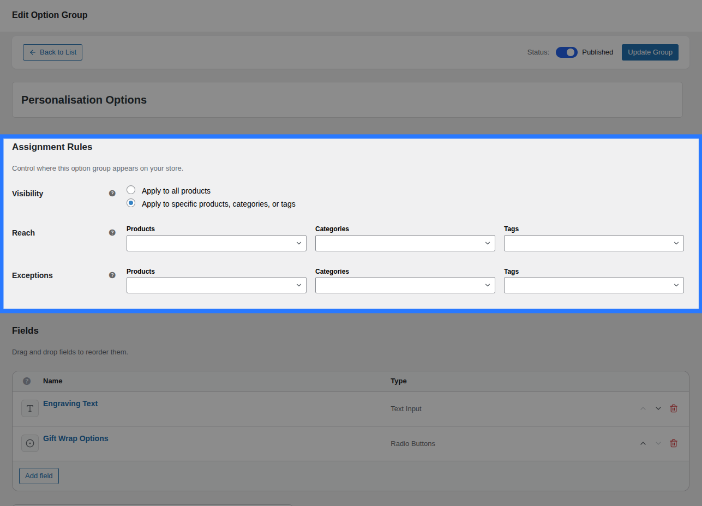
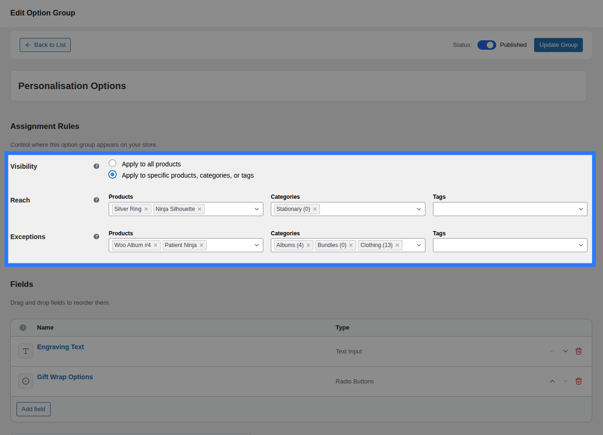

# Product Assignments

**Assignments** control which products an Option Group appears on. Each group can have multiple assignment rules that combine to determine its visibility across your store.



---

## How Assignments Work

When a customer visits a product page, OptionBay queries the `wp_optionbay_assignments` database table using a single indexed lookup. The query checks whether any published Option Groups match the current product's ID, category IDs, or tag IDs.

The result is a prioritised, deduplicated list of groups to render — resolved in milliseconds even on large stores.

---

## Assignment Targets

Each assignment rule targets one of four scopes:

| Target               | Description                                                          |
| -------------------- | -------------------------------------------------------------------- |
| **Global**           | The group appears on **all** products site-wide                      |
| **Specific Product** | The group appears on one or more individually selected products      |
| **Category**         | The group appears on all products in one or more selected categories |
| **Tag**              | The group appears on all products with one or more selected tags     |

You can add multiple rules of any type. OptionBay evaluates them all together.

---

## Adding Assignment Rules

Inside the Addon Builder, open the **Assignment Rules** section. Click **Add Rule** to add a new row.



For each rule, configure:

1. **Target Type** — Select Global, Product, Category, or Tag from the dropdown
2. **Target** — _(Not applicable for Global)_ Search and select the specific product, category, or tag
3. **Type** — Choose **Include** or **Exclude** (see below)
4. **Priority** — A number (default: `10`). Lower numbers have higher priority.

---

## Inclusion vs. Exclusion Rules

Rules can be either **inclusions** (the group _should_ appear) or **exclusions** (the group _should not_ appear).

### Example

Imagine you want a group to appear on all products in the "Jewellery" category **except** for the product "Silver Ring".

| Rule     | Target      | Type    |
| -------- | ----------- | ------- |
| Category | Jewellery   | Include |
| Product  | Silver Ring | Exclude |

OptionBay processes both rules together. Since the exclusion rule exists for "Silver Ring", the group will not appear on that product even though the category rule would otherwise include it.

::: tip Priority Tie-Breaking
When an exclusion rule and an inclusion rule have the **same priority**, the exclusion wins. Give inclusions a **lower priority number** (e.g. `5`) than exclusions (e.g. `10`) if you want inclusions to override.
:::

---

## Priority

Priority is a number that controls which rule "wins" when two conflicting rules apply to the same group:

- **Lower number = Higher priority** (e.g. priority `1` beats priority `10`)
- Default priority is `10`

**Use case:** You have a Global rule that includes a group on all products (priority 10) and a Product-specific exclusion to hide it from "Widget A" (priority 5). Since 5 < 10, the exclusion wins and the group is hidden on "Widget A".

---

## Removing Rules

Click the **× Remove** button at the end of any rule row to delete it. Unsaved changes are local until you click **Save**.

---

## Assignment Summary in the List

On the [Option Groups list](/builder/option-groups), the **Assigned To** column shows a human-readable summary of where each group is assigned:

| Summary shown              | Meaning                                            |
| -------------------------- | -------------------------------------------------- |
| `All Products`             | At least one Global rule exists                    |
| `3 categories, 2 products` | Category and/or product-specific rules (no global) |
| `None`                     | No assignment rules — the group never appears      |

::: warning Groups with no assignments never appear
A group must have at least one inclusion rule to display on any product page. A group with zero assignment rules is effectively invisible.
:::

---

## Technical Details

Assignment rules are stored in the `wp_optionbay_assignments` custom database table:

```sql
CREATE TABLE wp_optionbay_assignments (
    id          bigint(20) UNSIGNED NOT NULL AUTO_INCREMENT,
    group_id    bigint(20) UNSIGNED NOT NULL,   -- CPT post ID
    target_type varchar(20) NOT NULL DEFAULT 'global',  -- global | product | category | tag
    target_id   bigint(20) UNSIGNED NOT NULL DEFAULT 0, -- 0 for global
    is_exclusion tinyint(1) NOT NULL DEFAULT 0,
    priority    int(11) NOT NULL DEFAULT 10,
    PRIMARY KEY (id),
    KEY group_id (group_id),
    KEY target_lookup (target_type, target_id, is_exclusion, priority)
)
```

The composite index `target_lookup` makes the per-product resolution query extremely fast — it never scans the full table, regardless of how many groups or products you have.
