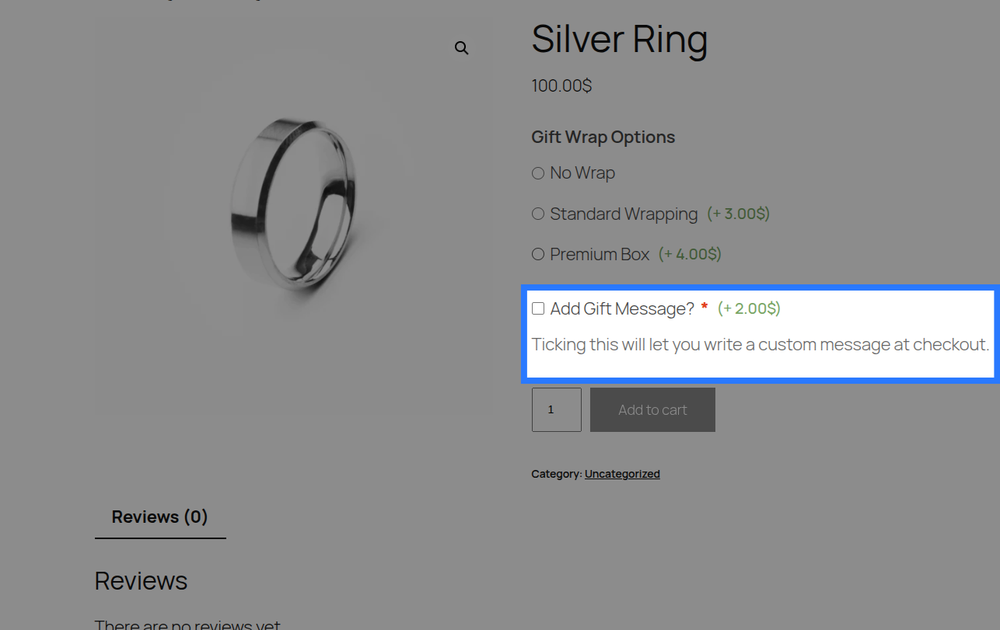
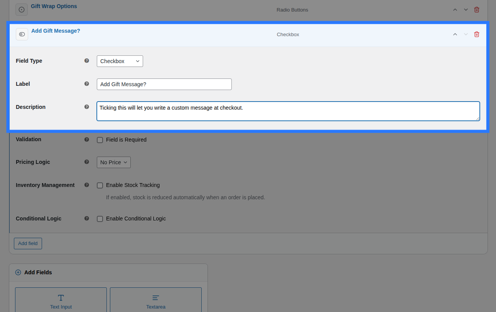
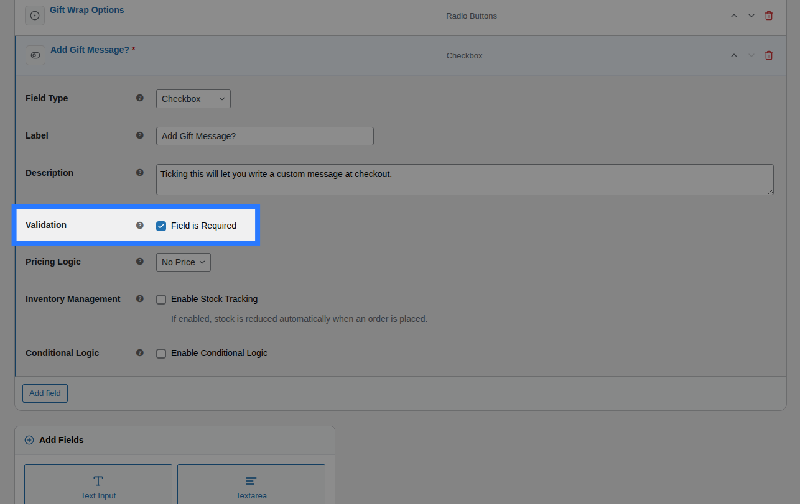
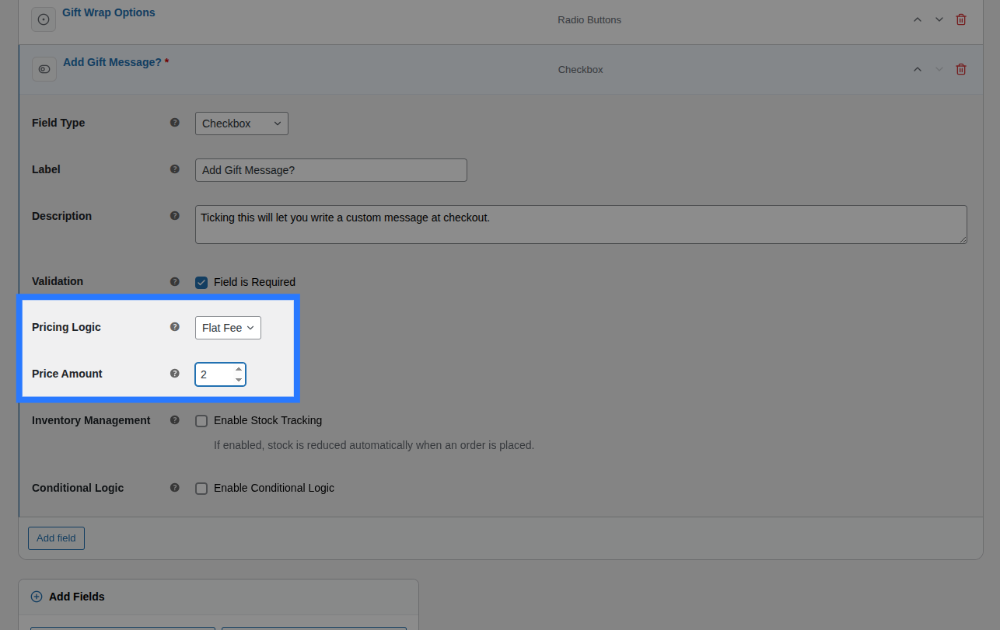
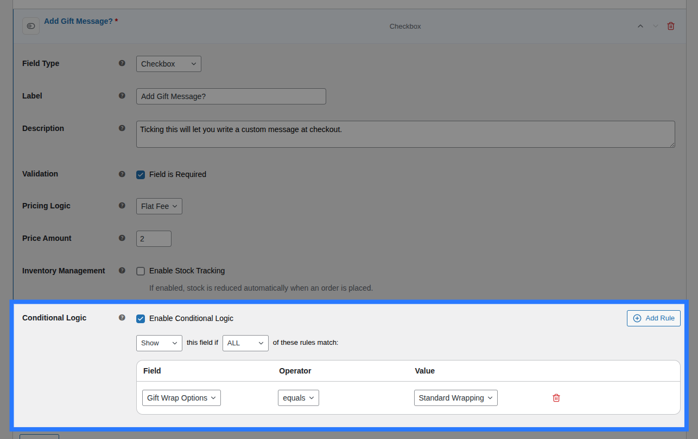
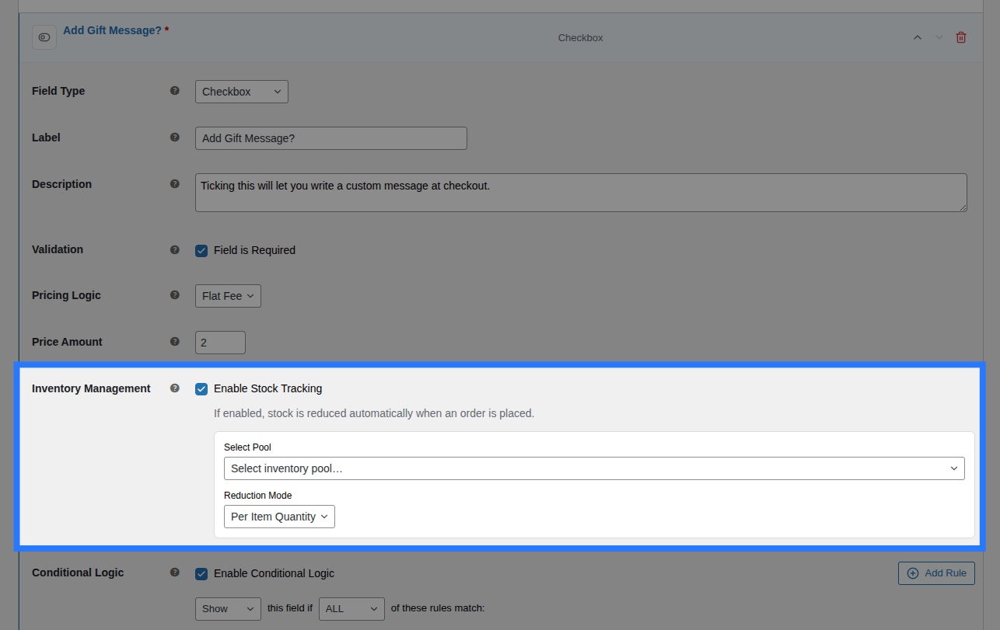

# Checkbox (Single)

A single standalone `<input type="checkbox">`. It allows the customer to toggle an option on or off (e.g., opting into a service or agreeing to a term).



---

## When to Use

- Opt-in extras (e.g. "Add gift wrapping (+$5.00)")
- Consent forms (e.g. "I agree to the terms and conditions")
- Confirmation toggles (e.g. "I confirm this is a custom order")
- Simple Yes/No decisions

---

## Configuration Settings

When you add a Checkbox field in the Addon Builder, you can configure the following inputs across different sections:

### General Settings



- **Label:** The text shown directly beside the checkbox. This acts as both the field title and the clickable label. Used to identify the field in the cart and order details.
- **Description:** Additional helper text shown below the checkbox. Useful for providing further clarification.

### Validation



- **Field is Required:** A checkbox toggle. When enabled, the customer is strictly forced to tick the checkbox before they are allowed to add the product to their cart. This is highly useful for mandatory consent fields (like Terms & Conditions).

---

## Pricing Logic



You can charge a fee when the customer ticks the checkbox. Configure this in the **Pricing** tab of the field.

**Available Inputs:**

- **Price Type:** Choose how the price is calculated.
  - _None:_ No charge.
  - _Flat Fee:_ A fixed charge added when the checkbox is ticked.
  - _Percentage:_ A percentage of the product's base price added when ticked.
  - _Math Formula:_ Advanced pricing logic.
- **Price Amount / Formula Expression:** Depending on the Price Type selected, enter the dollar amount, percentage value, or the exact math formula.

::: info Master the Pricing Engine
OptionBay includes five different pricing strategies, including dynamic math formulas. We've created a dedicated guide to explain all of them in detail.

**[Read the Ultimate Pricing Guide &rarr;](/pricing/index)**
:::

---

## Conditions



Open the **Conditions** tab to dynamically show or hide this Checkbox based on what the customer has selected in other fields.

**Available Inputs:**

- **Enable Conditional Logic:** Toggle to turn conditions on or off.
- **Action:** Choose whether to _Show_ or _Hide_ this field when conditions are met.
- **Match Type:** Choose _ALL_ (every rule must match) or _ANY_ (at least one rule must match).
- **Rules:** Define the specific field to watch, the comparison operator, and the value to check against.

_Example:_ Show the "Add Rush Processing?" checkbox only if the customer selects a specific date from a Date Picker.

::: info Learn More About Conditions
Conditional logic lets you build dynamic, branching forms that adapt as the customer interacts. See the full list of operators and examples in our detailed guide.

**[Read the Field Conditions Reference &rarr;](/fields/conditions)**
:::

---

## Stock



You can link the act of ticking this checkbox to a global inventory pool using the **Stock** tab.

**Available Inputs:**

- **Enable Stock Management:** Toggle to activate inventory tracking for this field.
- **Inventory Item:** Search and select an existing Global Stock Item, or create a new one directly from the dropdown.
- **Reduction Mode:** Choose how stock is deducted (Per Item Quantity, Per Line Item, or Formula).

::: tip Global Stock Management
OptionBay lets you share stock pools across multiple options and products, complete with cart-reservation to prevent overselling.

**[Read the Guide: Linking Options to Stock &rarr;](/stocks/field-linking)**
:::

---

## Example & Frontend Display

To see how this comes together, let's look at a common scenario: **Offering optional Gift Wrapping**. You want to let customers tick a box to get their item wrapped, and charge a flat $5.00 fee.

You would configure the Checkbox field like this:

- **Label:** `Add Premium Gift Wrapping?`
- **Description:** `Your item will be wrapped in premium paper with a ribbon.`
- **Price Type:** `Flat Fee`
- **Price Amount:** `5.00`

**Frontend Product Page View:**
With those settings, here is how the field renders on your product page for customers to interact with:


When a customer ticks the box and adds the product to their cart, OptionBay submits the value `"1"` to indicate it was checked. If left unchecked, the field is treated as empty and ignored.

**Cart & WooCommerce Order View:**
The field label and a "Yes" value will appear clearly on the cart page, checkout, and in your WooCommerce admin order screen exactly like this:

```
Add Premium Gift Wrapping?:   Yes
```
