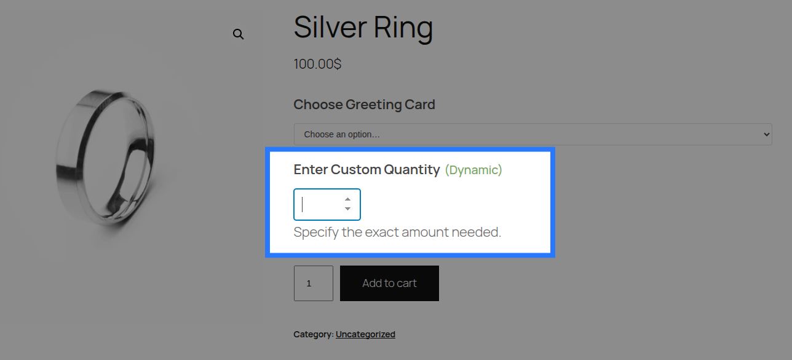
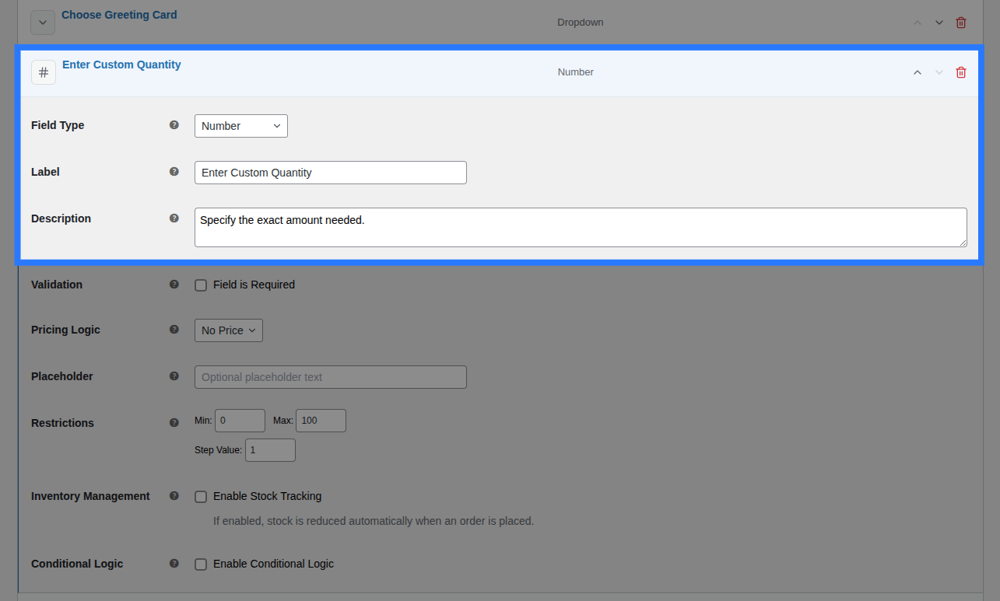
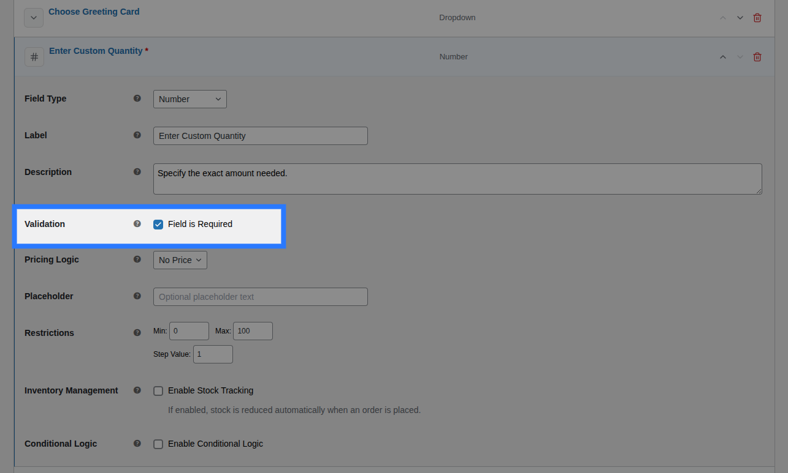
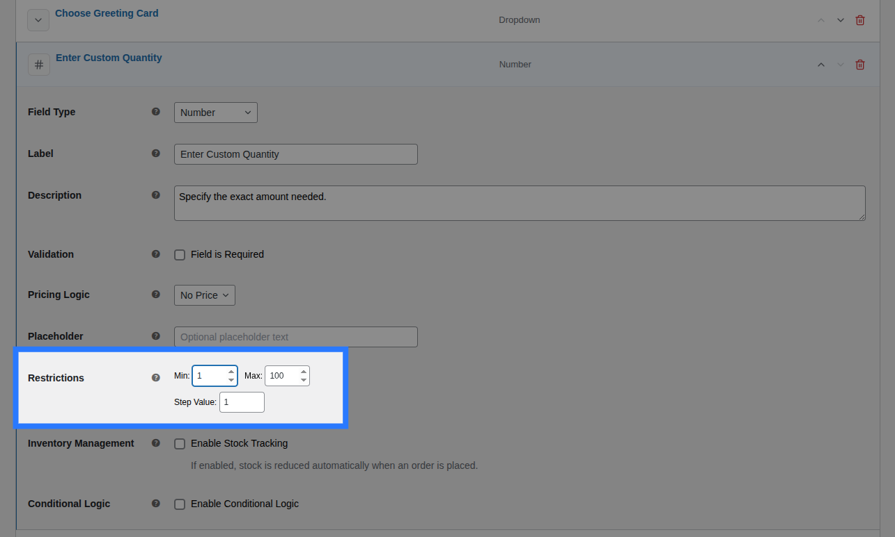
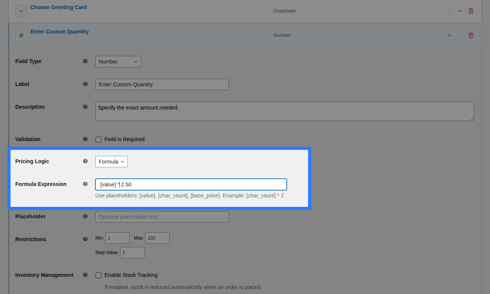
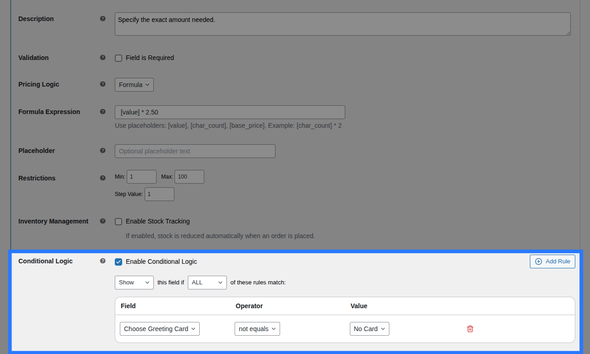
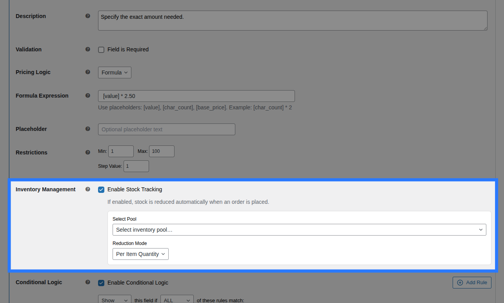

# Number Input

A numeric `<input type="number">` with browser-native up/down spinners. It forces the customer to enter a valid number, providing built-in browser controls and strict mathematical validation.



---

## When to Use

- Custom dimensions (width, height, length)
- Specifying custom quantities (e.g. "How many extra screws?")
- Age or year inputs
- Any metric that requires a mathematical calculation or formula pricing

---

## Configuration Settings

When you add a Number field in the Addon Builder, you can configure the following inputs across different sections:

### General Settings



- **Label:** The text heading displayed above the number input on the product page. Used to identify the field in the cart and order details.
- **Description:** Additional helper text shown below the input. Useful for providing instructions (e.g. "Enter width in centimeters").
- **Placeholder:** Grey hint text that appears inside the empty input (e.g., `e.g. 50`). It disappears once the customer starts typing.

### Validation



- **Field is Required:** A checkbox toggle. When enabled, the customer is forced to type a number into this field before they are allowed to add the product to their cart.

### Restrictions



Because this is a numeric field, restrictions dictate the mathematical boundaries of what the customer can enter.

- **Min Value:** The lowest number allowed. If the customer enters a number below this, the browser will block the submission.
- **Max Value:** The highest number allowed.
- **Step:** The increment by which the number can change.
  - Leave blank or set to `1` to only allow whole numbers (integers).
  - Set to `0.1` or `0.01` to allow decimals (e.g. `10.5` or `9.99`).

---

## Pricing Logic



You can charge extra based on the number the customer enters. Configure this in the **Pricing** tab of the field.

**Available Inputs:**

- **Price Type:** Choose how the price is calculated.
  - _None:_ No charge.
  - _Flat Fee:_ A fixed charge added whenever the customer enters any valid number.
  - _Percentage:_ A percentage of the product's base price added whenever the field is filled.
  - _Value Based:_ Charges an amount multiplied by the exact number the customer entered. If they enter `5` and the amount is `$2`, it adds `$10`.
  - _Math Formula:_ For advanced dynamic pricing. This is where the Number field shines. You can use the `[value]` placeholder to multiply the customer's input against the base price `[base_price]` or quantity `[quantity]`.
- **Price Amount / Formula Expression:** Depending on the Price Type selected, enter the multiplier or the exact math formula.

::: info Master the Pricing Engine
OptionBay includes five different pricing strategies, including dynamic math formulas. We've created a dedicated guide to explain all of them in detail.

**[Read the Ultimate Pricing Guide &rarr;](/pricing/index)**
:::

---

## Conditions



Open the **Conditions** tab to dynamically show or hide this Number field based on what the customer has selected in other fields.

**Available Inputs:**

- **Enable Conditional Logic:** Toggle to turn conditions on or off.
- **Action:** Choose whether to _Show_ or _Hide_ this field when conditions are met.
- **Match Type:** Choose _ALL_ (every rule must match) or _ANY_ (at least one rule must match).
- **Rules:** Define the specific field to watch, the comparison operator (e.g., `==`, `is not empty`), and the value to check against.

_Example:_ Show the "Custom Width (cm)" input only when the customer selects "Custom Size" from a previous Size dropdown.

::: info Learn More About Conditions
Conditional logic lets you build dynamic, branching forms that adapt as the customer interacts. See the full list of operators and examples in our detailed guide.

**[Read the Field Conditions Reference &rarr;](/fields/conditions)**
:::

---

## Stock



You can link the customer's numeric entry directly to inventory pools using the **Stock** tab.

**Available Inputs:**

- **Enable Stock Management:** Toggle to activate inventory tracking for this field.
- **Inventory Item:** Search and select an existing Global Stock Item, or create a new one directly from the dropdown.
- **Reduction Mode:**
  - _Per Item Quantity:_ Standard 1-to-1 deduction.
  - _Per Line Item:_ Deduct 1 stock regardless of product quantity.
  - _Formula:_ Use `[value]` to deduct stock based on the number the customer typed. (e.g. if they enter `5`, deduct 5 units from stock).

::: tip Global Stock Management
OptionBay lets you share stock pools across multiple options and products, complete with cart-reservation to prevent overselling.

**[Read the Guide: Linking Options to Stock &rarr;](/stocks/field-linking)**
:::

---

## Example & Frontend Display

To see how this comes together, let's look at a common scenario: **Selling custom-cut fabric by the meter**. You want to let customers type exactly how many meters they need (allowing decimals), and charge them $15.00 per meter.

You would configure the Number field like this:

- **Label:** `Length Required (Meters)`
- **Description:** `Enter the exact length you need. We cut to the nearest centimeter.`
- **Placeholder:** `e.g. 2.5`
- **Min Value:** `1`
- **Max Value:** `50`
- **Step:** `0.01` (This allows decimals like 2.50)
- **Price Type:** `Value Based`
- **Price Amount:** `15.00`

**Frontend Product Page View:**
With those settings, here is how the field renders on your product page for customers to interact with:


When a customer fills out the field and adds the product to their cart, the data is safely sanitized using WordPress's `floatval()` or `intval()` to ensure no malicious text or HTML can be submitted.

**Cart & WooCommerce Order View:**
The field label and the customer's typed number will appear clearly on the cart page, checkout, and in your WooCommerce admin order screen exactly like this:

```
Length Required (Meters):   2.5
```
