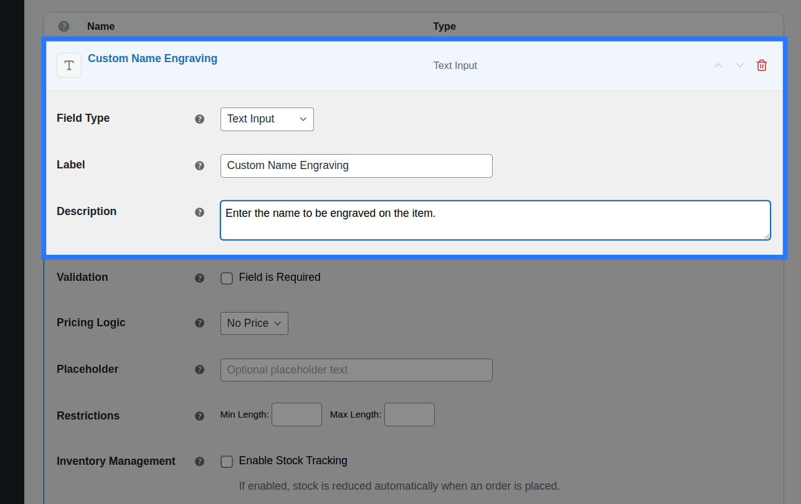
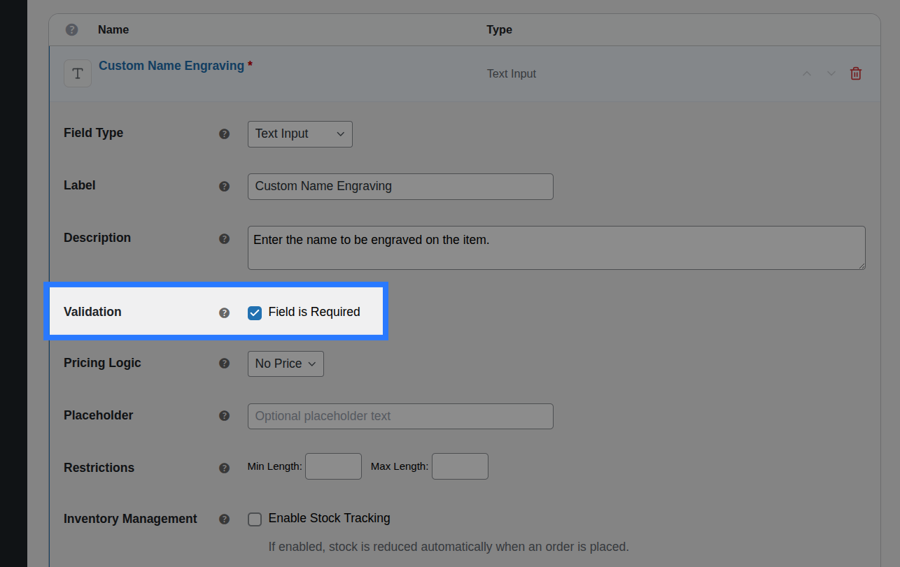
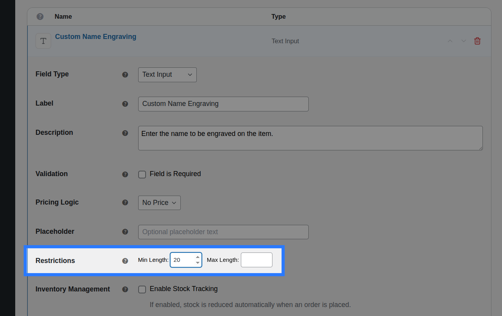
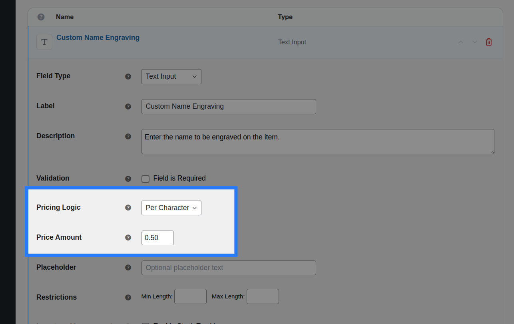
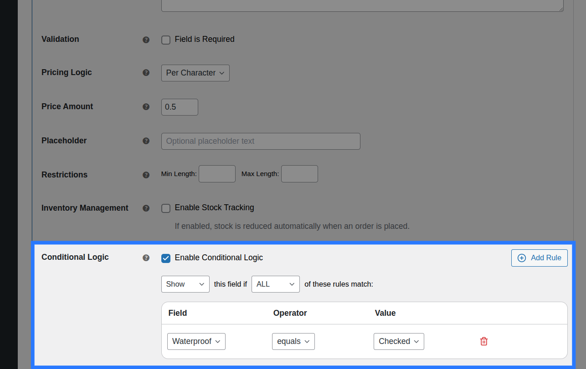
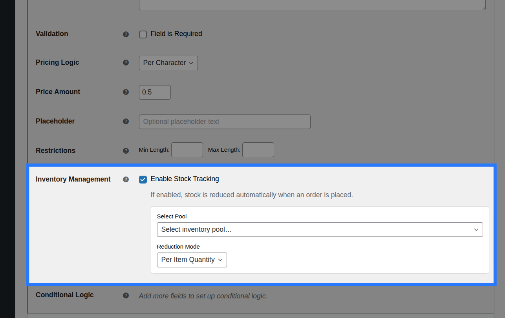
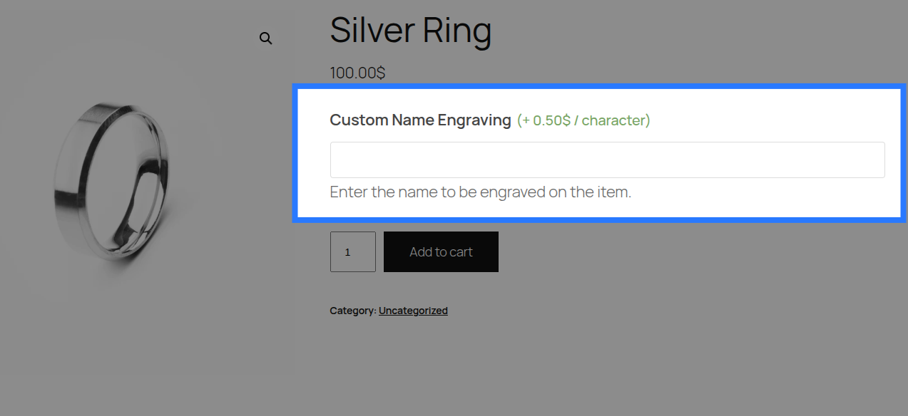

# Text Input

A single-line free-text input — the most common field for short customer-typed entries like names, messages, or monograms.

---

## When to Use

- Personalisation name or monogram
- Short engraving message (up to ~40 characters)
- Custom label or team name
- Any brief free-form entry

---

## Configuration Settings

When you add a Text Input field in the Addon Builder, you can configure the following inputs across different sections:

### General Settings



- **Label:** The main text heading displayed above the input field on the product page. Used to identify the field in the cart and order details.
- **Description:** Additional helper text shown below the input. Useful for providing instructions or examples to the customer.
- **Placeholder:** Grey hint text that appears inside the empty input field (e.g., `Max 30 characters`). It disappears once the customer starts typing.

### Validation



- **Field is Required:** A checkbox toggle. When enabled, the customer is forced to type something into this field before they are allowed to add the product to their cart. Whitespace-only values are rejected.

### Restrictions



- **Min Length:** The minimum number of characters the customer must type. If set, an error is shown if they type fewer characters.
- **Max Length:** The absolute maximum number of characters allowed. The browser will physically prevent the customer from typing more than this limit.

---

## Pricing Logic



You can charge extra when a customer fills out the Text Input field. Configure this in the **Pricing** tab of the field.

**Available Inputs:**

- **Price Type:** Choose how the price is calculated.
  - _None:_ No charge.
  - _Flat Fee:_ A fixed charge added whenever the customer types anything.
  - _Percentage:_ A percentage of the product's base price added whenever the field is filled.
  - _Character Count:_ Charges a set amount per character typed. The price updates live on the frontend as the customer types. This is the **most common pairing** for engraving.
  - _Math Formula:_ For advanced dynamic pricing using placeholders like `[char_count]`, `[base_price]`, and `[quantity]`.
- **Price Amount / Formula Expression:** Depending on the Price Type selected, enter the dollar amount, percentage value, character rate, or the exact math formula.

::: info Master the Pricing Engine
OptionBay includes five different pricing strategies, including dynamic math formulas. We've created a dedicated guide to explain all of them in detail.

**[Read the Ultimate Pricing Guide &rarr;](/pricing/index)**
:::

---

## Conditions



Open the **Conditions** tab to dynamically show or hide this Text field based on what the customer has selected in other fields.

**Available Inputs:**

- **Enable Conditional Logic:** Toggle to turn conditions on or off.
- **Action:** Choose whether to _Show_ or _Hide_ this field when conditions are met.
- **Match Type:** Choose _ALL_ (every rule must match) or _ANY_ (at least one rule must match).
- **Rules:** Define the specific field to watch, the comparison operator (e.g., `==`, `is not empty`), and the value to check against.

_Example:_ Show the "Engraving Text" input only when a customer checks the "Add Engraving?" checkbox.

::: info Learn More About Conditions
Conditional logic lets you build dynamic, branching forms that adapt as the customer interacts. See the full list of operators and examples in our detailed guide.

**[Read the Field Conditions Reference &rarr;](/fields/conditions)**
:::

---

## Stock



While less common for text inputs, you can link the act of filling out this field to a global inventory pool using the **Stock** tab. This is useful if entering text consumes a physical resource, like a "Custom Design Slot".

**Available Inputs:**

- **Enable Stock Management:** Toggle to activate inventory tracking for this field.
- **Inventory Item:** Search and select an existing Global Stock Item, or create a new one directly from the dropdown.
- **Reduction Mode:** Choose how stock is deducted (Per Item Quantity, Per Line Item, or Formula).

::: tip Global Stock Management
OptionBay lets you share stock pools across multiple options and products, complete with cart-reservation to prevent overselling.

**[Read the Guide: Linking Options to Stock &rarr;](/stocks/field-linking)**
:::

## Example & Frontend Display

To see how this comes together, let's look at a common scenario: **Selling a personalized watch**. You want to let customers type a message, and charge them $0.50 per character.

You would configure the Text Input field like this:

- **Label:** `Engraving Text`
- **Description:** `Enter the message to be engraved on the back of the watch.`
- **Placeholder:** `Max 30 characters`
- **Price Type:** `Character Count`
- **Price Amount:** `0.50`

**Frontend Product Page View:**
With those settings, here is how the field renders on your product page for customers to interact with:



When a customer fills out the field and adds the product to their cart, the data is safely sanitized using WordPress's `sanitize_text_field()` (which strips HTML and trims extra whitespace).

**Cart & WooCommerce Order View:**
The field label and the customer's typed text will appear clearly on the cart page, checkout, and in your WooCommerce admin order screen exactly like this:

```
Engraving Text:   Happy Birthday, Sarah!
```
