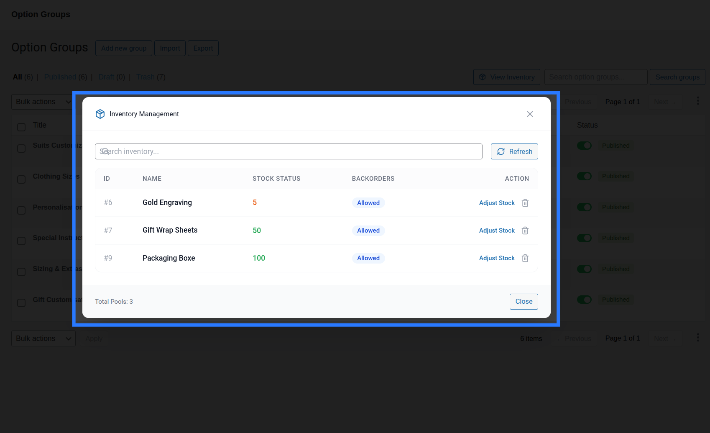
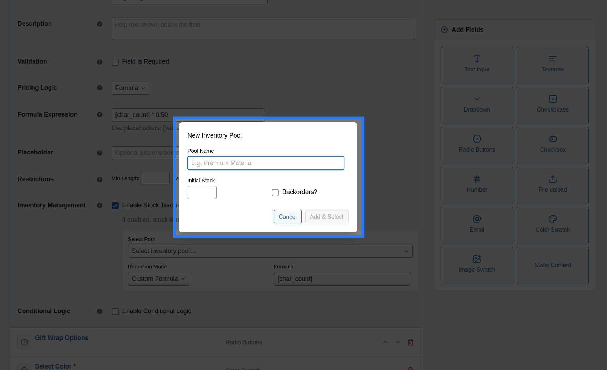
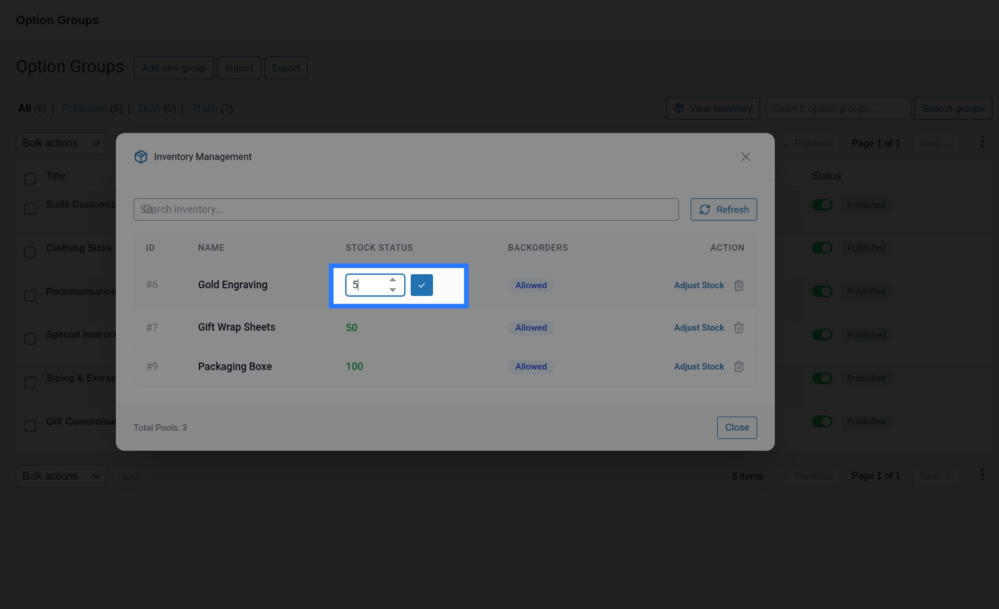

# Global Stock Management

The **Global Stock** system lets you track and limit inventory for shared resources that are consumed when customers select specific options — independently of WooCommerce's product stock.

Unlike WooCommerce's built-in stock system which tracks inventory per product variant, OptionBay's Global Stock operates at the option level. This makes it possible to manage inventory for shared physical materials, service capacities, or time slots across different products.

---

## Common Use Cases

- **Shared Physical Materials:** Limit how many orders can include a specific add-on (e.g. premium "Silver Foil wrapping paper" with 50 sheets available) across all products in your store.
- **Service Capacity Limits:** Cap the number of weekly custom engraving slots or hand-painted design slots available to purchase.
- **Limited Run Options:** Restrict a promotional premium choice option (e.g. "Limited Edition signed box") to a fixed pool of customers.

---

## How It Works

Instead of tracking stock per product, Global Stock Items are **shared pools** that any option (across any product) can draw from.

When a customer selects an option linked to a stock item:

1. **Real-Time Reservation:** The stock item's available quantity is reserved in real time while the item sits in their cart, protecting against double-reserving the last remaining items.
2. **Permanent Deduction:** On order completion, the reserved stock is permanently deducted from the stock item's count.
3. **Automatic Restoration:** If the order is cancelled or refunded, the deducted stock is automatically restored to the pool.

---

## The Inventory Modal

You can access the inventory manager from the [Option Groups](/builder/option-groups) list page by clicking the **View Inventory** button (📦 icon) in the top-right controls area.

The modal provides a centralized table showing all your Global Stock Items with the following columns:

- **Name:** The internal descriptive name of the stock pool (e.g., "Gift Wrap Sheets", "Engraving Slots").
- **Stock Count:** The current available inventory. This value can support decimal figures for fractional calculations (e.g., `150.50` representing material length or fractional weights).
- **Allow Backorders:** A toggle switch indicating whether customers can still purchase options linked to this item when the stock count reaches `0` or goes negative.
- **Actions:** Quick buttons to edit the stock item's configuration inline or permanently delete the stock item.

---

## Creating a Stock Item

Click the **Add Item** button at the top of the inventory modal to expand the creation form.

- **Name:** Enter a descriptive internal name (e.g., "Gift Wrap Sheets", "Engraving Slots").
- **Stock Count:** Enter the starting inventory count. This can be a whole integer or a decimal number.
- **Allow Backorders:** Enable this toggle if you want to allow orders to continue when stock is empty. The count will go into negative numbers to track backordered quantities.

::: tip Creating Items Inline
You can also create new inventory items directly inside the **Stock tab** of any field in the [Addon Builder](/builder/addon-builder) without opening the inventory modal — type a new name in the search box and click the **Create new** option at the bottom of the results.
:::

---

## Editing & Deleting Stock Items

Manage existing stock items directly within the inventory modal table:

- **Editing an Item:** Click **Edit** on any row to open the inline editor. You can change the item's name or adjust the stock count to reflect physical inventory updates. Click **Save** to apply.
  - 
- **Deleting an Item:** Click **Delete** on any row to remove the stock pool.
  - ::: warning Deletion Effects
    Deleting a stock item removes it permanently from the database. Any options currently linked to this stock item will have their stock management disabled automatically.
    :::

---

## Stock Depletion Lifecycle

OptionBay manages stock updates at every stage of the customer shopping journey:

- **Step 1 — Cart Reservation:** When a customer selects a linked option and adds the product to their cart, OptionBay reserves that stock. If they empty their cart or the cart session expires, the reservation is released.
- **Step 2 — Checkout Check:** During checkout submission, a final check is run. If stock is depleted, the order is blocked. Otherwise, checkout completes and stock is permanently deducted.
- **Step 3 — Order Status Sync:** If the order is cancelled, refunded, or failed in WooCommerce, OptionBay reads the line item metadata and automatically restores the stock.

::: info Learn More: Linking Stock
To see how to connect your fields and options to these global stock pools, including setting up custom reduction formulas, check out our field linking guide.

**[Read the Guide: Linking Options to Stock &rarr;](/stocks/field-linking)**
:::
